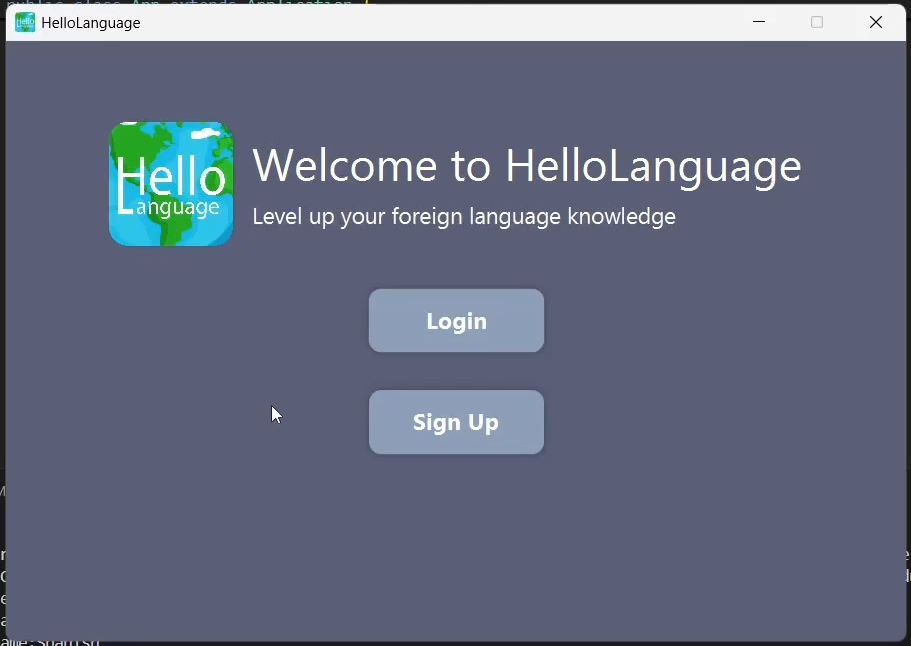
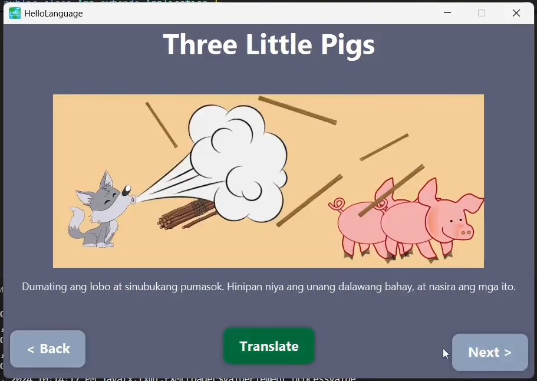

# Hello Language by Hello Worlders
## Children's Foreign Language Learning App

  
  

    Our application is designed to help English children learn foreign languages 
    through interactive content and storybooks. The software offers three difficulty 
    levels (easy, medium, and hard), making it suitable for a wide range of learners, 
    yet primarily focused on primary school aged children.
  

## See what we did!
Get an idea of the final project with the graphical sser interface video walk-through on YouTube here or scroll down to check out the screenshots.

## Features
- **Interactive Games**: Engaging games such as Alphahabet, Colors, Numbers that make learning fun.
- **Storybooks**: Read along with stories to enhance vocabulary.
- **Difficulty Levels**: Easy, Medium, and Hard to suit different learners.
- **Progress Tracking**: Monitor your learning journey and achievements.

## Reference Images
### Intro Screen

### Main Menu

### Language Select

### Game Select

### Story Book Page

### Start Brain Blaster

### Multiple Choice Question

### Fill in the Blank

### Matching Question

### Matching Question

### More
* Difficulty selection
* Content Learning
* Progress Check
* Sign up and signin
* Settings
* Local data storage

#### [Video Walk-through](https://youtu.be/9BkRCLGuQPQ)

